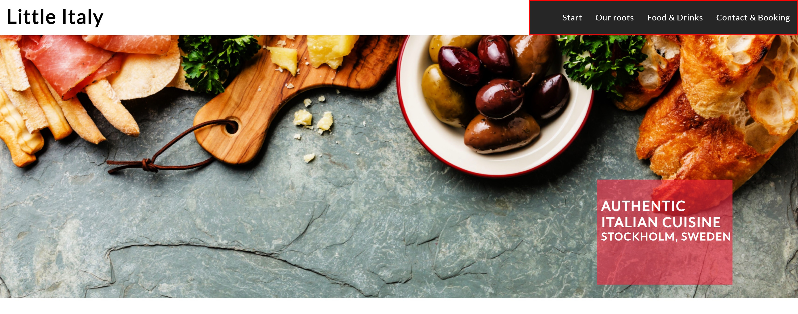
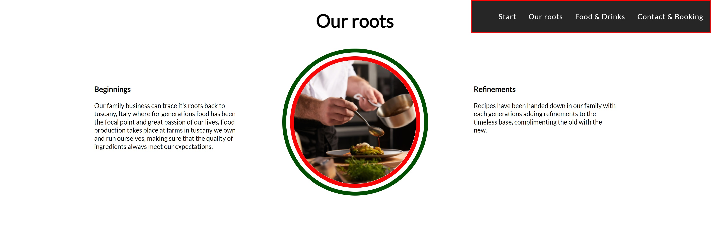
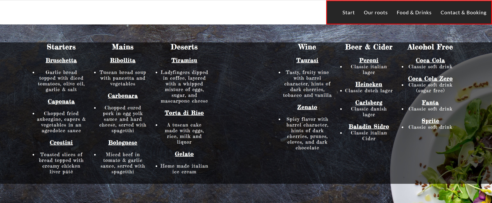
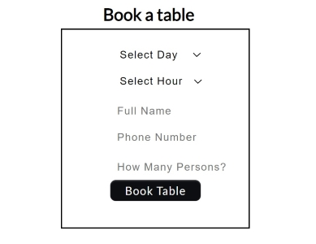
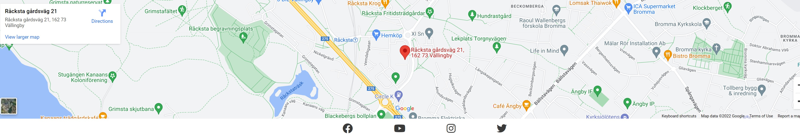

# Little Italy

The Little Italy website is made to give potential customers ease of access to contact information, menu items and location of the restaurant.

## User stories

- End user goal: The user wants tasty and nutricious food.
- End business goal: Increase amount of purchases.
- Acceptance criteria: Fresh produce put in to recipies with correct ingredients in the correct amount.
- Measurement of success: Recurring customers, amount of bookings, amount of purchases & positive customer feedback.

## Features

The website contains a Navigation bar, a food and drinks menu, a Google maps overlay and a section for table booking.

### Existing Features

- __Navigation Bar__

Responsive sectional navigation through a navbar takes the user to the Menu, Contact & Booking, Our roots, and Location sections respectively, forgoing exessive scrolling and increasing ease of use.

- __The landing Page image__

An image background conveying the herritage and setting the atmosphere of the restaurant and cuisine served here.

- __Our roots__

A section giving insight into the roots of the family business and the area of Italy drawn inspiration from for our recipies.

- __Food & Drinks Menu__

A small yet carefully selected and descriptive menu of food and drinks offered to the customer.

- __Contact & Booking__

Full booking information including: Full name, Phone number, Booking day and hour, number of persons and email for confirmation of booking.
(Attribute to Prabinmagar for booking template: https://github.com/prabinmagar/restaurant-reservation-form/blob/master/index.html)

- __Footer__

Gives location of the restaurant as well as links to social media.

### Features to implement

- Large scale catering booking.

 

## Technologies
- Navigation bar:
  - Start button: Will take you back to the top of the page on click.
   
  
  - Our roots button: Will take you to the "about us" section retitled "Our roots".
   
  
  - Food & Drinks button: Will take you to the Food and Drinks menu.
   
  
  - Contact & Booking button: Will take you to the booking section for table booking and phone number set in the Maps inlay to contact us. Select day of booking, hour of that day, your full name, phone number and how many persons the booking is for.
   
  
   

## Code Validation
- W3C CSS Validator Passed

- W3C HTML Validator Passed

## Fixed Bugs
- The body element of the html.index file had its width set to 100vw causing a horizontal scrollbar to appear. Setting the width to 100% fixed the issue.

## Supported Devices
- All device types are supported from mobile phones to tablets and computer screens small to large. This responsive design is accomplished through Media query parameters set at the respective widths of different devices.

  

